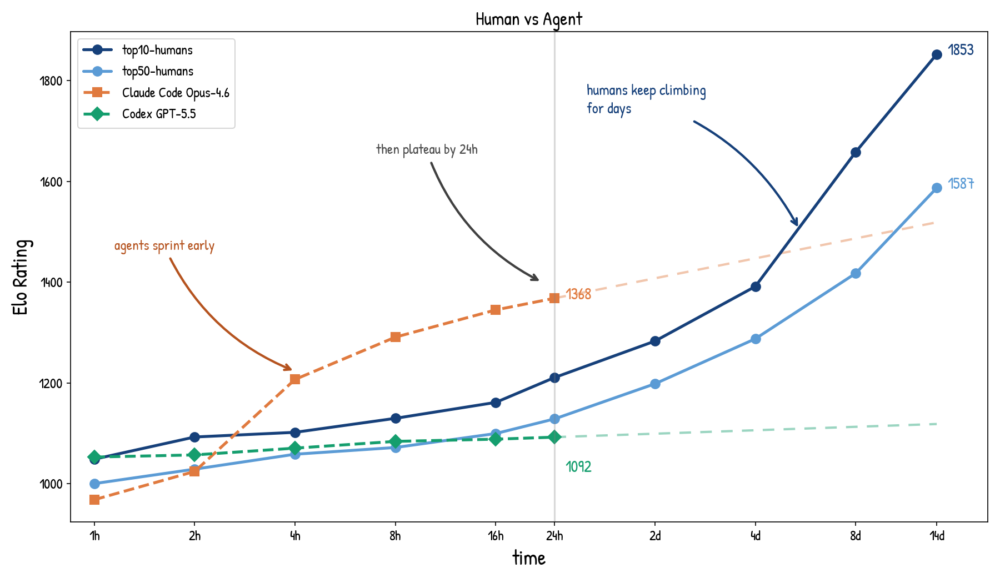

# Coding with AI

AI can help you code faster.
Your job is to make sure the work gets better.

<div class="pt-12">
  <span class="px-2 py-1 rounded text-sm">
    ReDI School — AI Workshop
  </span>
</div>

<!--
Welcome. 60 minutes, hands-on. Most of the time you will be coding, not listening.
-->

---

# Who am I

- **Chiawei Ong**
- I'm an engineering manager at Leapsome, leading a team building AI and HR software
- I use AI everyday for writing, reviewing, testing software

<div class="punchline">

I use this "loop" every day — today you'll leave with the same workflow.

</div>

<!--
FILL IN before presenting. Keep it under a minute: name, what you do, and how you use AI daily on real work.
-->

---

# Before we start

You should have:

- Git and Node.js 20+
- A working coding agent, e.g. OpenCode with **MiniMax-M3** under OpenCode Go
- The `workshop-chat-client.zip` downloaded
- A browser

<v-click>

<div class="punchline">

⚠️ Something not working? Tell us now and we can start helping you.

</div>

</v-click>

<!--
Quick scan of the room. Anyone blocked gets paired with a working neighbor — do it now so it doesn't eat practice time.
-->

---
layout: section
---

# Why AI coding needs a workflow

<!--
0:00–0:08. One idea to land: AI makes you faster, but speed is not the same as good project work.
-->

---

# Faster is not the same as better

AI can write a lot of code, quickly.

<v-clicks>

- Who is responsible for the actual work?
- Who knows how it should work when something breaks?
- Who is the one learning from the work / applying for jobs?

</v-clicks>

<v-click>

<div class="punchline">

**Research finding 1:** people move faster with AI, but they learn more when they stay active — asking questions, reading code, explaining changes.

</div>

</v-click>

<!--
Anthropic study (Shen & Tamkin 2026), mentioned briefly. Speed without engagement means less understanding — and in project work, understanding is part of the deliverable.
-->

---
layout: two-cols
---

# Projects are long-horizon work

A project lasts longer than one prompt.

You need habits that carry context forward:

- tests and browser checks
- small commits and review
- docs and project instructions

::right::

<div class="pl-4 pt-12">
  
</div>

<v-click>

<div class="punchline">

**Research finding 2:** strong project work depends on memory, feedback, reflection, and adaptation.

</div>

</v-click>

<!--
"Humans Don't Just Sample" — the human role is the feedback loop across tasks, not just this task. The graph is illustrative: AI output per task is roughly flat, while a human who keeps memory, feedback, and reflection compounds over the life of a project. We show it again at the end. References are in the workshop reference list.
-->

---

# After every piece of work, can you…

<v-clicks>

1. explain **what changed** and how it works?
2. name the **assumptions and tradeoffs**?
3. come back tomorrow with a **better setup** than today?

</v-clicks>

<v-click>

<div class="punchline">

This is how developers build judgment or "taste". Even more important while you are a "junior".

</div>

</v-click>

<!--
These three questions are the whole motivation for the loop we teach next. Everything in the workshop serves one of them. Emphasize: this is not homework for juniors — it's how anyone contributing to a codebase learns the decisions behind it and develops taste.
-->

---
layout: section
---

# The AI coding loop

<!--
0:08–0:15. The repeatable model. Keep the sequence clear; don't explain every tool.
-->

---

# One loop, every task

1. Confirm a **clean start**
2. Ask the agent to **inspect before editing**
3. Write a short **plan**, get AI feedback, and decide what to use
4. Ask the agent to **implement your revised plan**
5. Run one useful **check**
6. Read the **diff** — can you explain it?
7. **Commit** with a message that says why
8. Record one **lesson** for next time

<div class="punchline">

AI feedback is input. **You decide what to use.**

</div>

<!--
Participants don't memorize this — they get it again in the practice task and the checklist. The skill is noticing when you skip a step and going back.
-->

---
layout: two-cols
---

# Git is your safety net

<div class="text-xl mt-8">

**Diff** — the exact change, before you accept it

**Commit** — a checkpoint you can explain and return to

Small commits make AI work easier to review, undo, and explain.

You can ask the agent to show, compare, or move to a specific commit.
That "time travel" helps you see how the work changed.

</div>

::right::

<div class="pl-4 pt-14">

<svg viewBox="0 0 420 190" class="w-full" style="max-width: 440px; font-size: 13px">
  <!-- commit history -->
  <line x1="30" y1="60" x2="390" y2="60" stroke="#5b8a9e" stroke-width="2.5" />
  <circle cx="60" cy="60" r="8" fill="#5b8a9e" />
  <circle cx="130" cy="60" r="8" fill="#5b8a9e" />
  <circle cx="200" cy="60" r="8" fill="#5b8a9e" />
  <circle cx="280" cy="60" r="8" fill="#5b8a9e" />
  <circle cx="350" cy="60" r="8" fill="#5b8a9e" />
  <text x="30" y="40" fill="#5b8a9e" style="font-size: 14px; font-weight: bold">main</text>
  <!-- diff tag on latest commit -->
  <rect x="322" y="150" width="56" height="26" rx="5" fill="none" stroke="#999" stroke-width="1.5" />
  <text x="332" y="168" fill="#7cb87c" style="font-size: 13px; font-family: monospace">+3</text>
  <text x="354" y="168" fill="#d47c7c" style="font-size: 13px; font-family: monospace">−1</text>
  <line x1="350" y1="150" x2="350" y2="72" stroke="#999" stroke-width="1" stroke-dasharray="3,3" />
  <text x="386" y="168" fill="#999" style="font-size: 12px">diff</text>
  <!-- commit label -->
  <line x1="280" y1="48" x2="280" y2="28" stroke="#999" stroke-width="1" stroke-dasharray="3,3" />
  <text x="260" y="22" fill="#999" style="font-size: 12px">commit</text>
</svg>

</div>

<v-click>

<div class="punchline">

Forgot the command? **Ask the agent.** Knowing what the step is for matters more.

</div>

</v-click>

<!--
Not a Git lesson. Keep it to diffs and commits. Small commits make AI work safer: easier to inspect, undo, and explain.
-->

---

# Bring a specific, scoped plan

<div class="grid grid-cols-2 gap-4 mt-6">

<div class="p-4 bg-red-500 bg-op-10 rounded">

❌ *"Improve this page and fix anything you find."*

Ten changed files. No idea which one mattered.

</div>

<div class="p-4 bg-green-500 bg-op-10 rounded">

✅ *"My plan is to preserve the error and return to the join form. Evaluate it before editing."*

One focused diff you can actually read.

</div>

</div>

<!--
This is the 02 contrast, compressed. The participant brings the plan; AI can challenge it, but the participant decides what to use. The size test: if you can't review the diff, the task was too big.
-->

---

# Who already knows this?

Hands up:

- Used Git on a real project?
- Used a coding agent — OpenCode, Claude Code, Codex?
- Written a test?
- Done a browser check or code review?

<v-click>

<div class="punchline">

If you raised a hand: **sit near someone newer** and help during practice.

In a non-technical role? **Sit next to a technical person** and pair.
Guide with questions — don't take the keyboard.

</div>

</v-click>

<!--
0:15–0:20. While the room re-sorts: START THE DEMO'S INSPECT PROMPT in your OpenCode session now. This hides the first latency wait.
-->

---
layout: section
---

# Demo: fix a real bug

Connect with a name that's already taken → the client shows a disconnect and a dead end.

Watch for the loop steps.

<!--
0:20–0:30. Switch to terminal + two browser tabs. Full script in the teacher runbook: show bug, clean status, inspect, write a plan, evaluate feedback, decide and revise, implement, npm test + browser, diff, commit, record one lesson. Hard stop at 0:30.
-->

---

# Reading a diff

```diff
--- a/src/app.js
+++ b/src/app.js
-  showStatus("Disconnected from server");
+  showStatus(serverErrorMessage || "Disconnected from server");
+  showJoinForm();
```

<v-clicks>

- `-` removed, `+` added
- **File names first** — are these the files you expected?
- Each `+` line: can you say what it does?
- Unrelated change (a rename, a reformat, an untouched-task file)? **Ask why. Ask to undo it.**

</v-clicks>

<!--
60 seconds, during or right after the live diff. This slide is the backup if the live diff is messy. The diff shown is illustrative, not the exact fix.
-->

---
layout: two-cols
---

# Practice: show message times

The server sends a `timestamp`. The client ignores it.
Make events show a short local time, like `10:42`.

**Done when:**

- messages and events show a time
- errors still work without one
- `npm test` passes, one new or updated test
- it looks right in the browser

Follow the **practice task** — it has the task, requirements, prompts, and the full loop.

::right::

<div class="pl-6 pt-10">

```text
Server URL:
wss://quick-badly-amoeba.ngrok-free.app
```

```bash
npm test
npm start   # → localhost:5173
git diff
```

<div class="mt-6 p-3 bg-orange-500 bg-op-10 rounded text-sm">

⚠️ The time must come from the **server's `timestamp`**, not from when your browser renders it. Read your diff.

</div>

</div>

<!--
0:30–0:50. This slide stays up for 20 minutes. Say three things, then circulate: one small task, work the loop, watch the timestamp trap. Failure table is in the runbook.
-->

---
layout: statement
---

# Commit what you have

Even unfinished.

A work-in-progress commit you can explain
beats uncommitted perfect code.

<!--
0:50 hard call. Say it to the whole room. Two minutes, then participants explain to a neighbor.
-->

---

# Explain to your neighbor

Show them your diff and explain it in your own words.

Do not read the agent's output aloud. Explain:

1. Your **plan** and one AI suggestion you accepted or rejected
2. **What** changed
3. **How** you checked it
4. One **lesson** you'd write down for next time

<!--
0:52–0:57. This is where understanding becomes visible: participants explain the diff to another person without relying on the agent's wording. The lesson note counts as the final loop step for anyone who skipped it.
-->

---

# Before you commit, ask yourself

<div class="text-xl mt-8">

What is my **plan** for the smallest useful change?

How will I **check** it?

Can I **explain the diff** before I commit?

</div>

<v-click>

<div class="punchline">

Take the **AI coding checklist** with you — it has the loop and the prompts for your own projects.

</div>

</v-click>

<!--
0:57–1:00. The three closing questions from the wrap-up. Checklist link goes in Slack.
-->

---
layout: two-cols
---

# This is how we work day-to-day

This loop is not just for the workshop.
Engineers use these habits every day:
start clean, inspect, plan, get feedback, implement, check, review, commit, and write down what changed.

Over time, this helps you build:

- better judgment
- a clearer project history
- a workflow you can trust

::right::

<div class="pl-4 pt-12">
  
</div>

<!--
Close the arc: same graph as the opening. The loop is not a junior exercise — it is the daily professional workflow, and it is the part people need to own.
-->

---
layout: end
---

# One question before you go

**Which step of the loop will you actually use next week?**

Say it out loud or drop it in Slack.

Thank you 🙌

<!--
The feedback answers tell us which habit landed and what to emphasize next run.
-->
